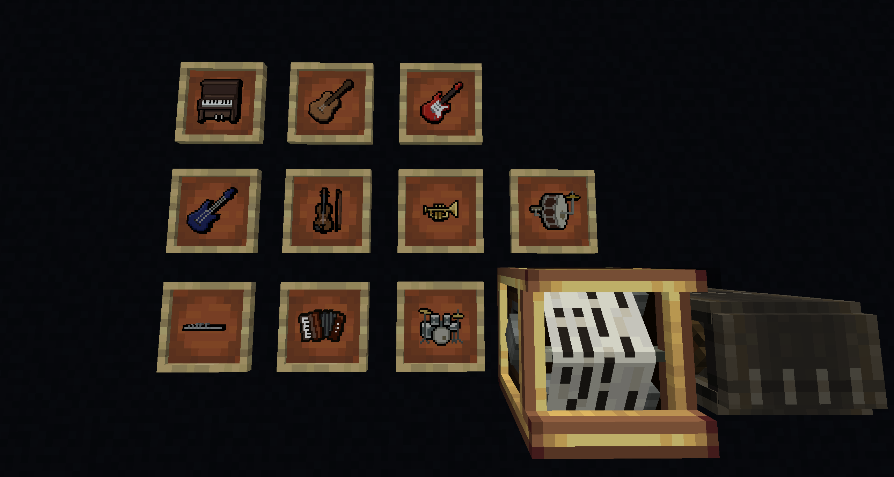
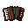
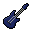
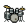
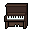

<div align="center">
  
  <h1>Create: Polyphony</h1>
</div>

Create: Polyphony is a NeoForge addon for [Create](https://modrinth.com/mod/create) + [Create: Sound of Steam](https://github.com/CSOS-Team/SoundOfSteam). 

Explore handheld instruments and co-op musical play in the Create ecosystem. The idea is simple: pick up an instrument and play. Use it on your own, play with friends, annoy nearby mobs, or hand the job over to a Create contraption and let the machine join in. The mod is built around music as something you actively do in-game, not just something that happens in the background.

Custom SoundFont (`.sf2`) support is one of the big features here, giving you control over how instruments actually sound. Swap in different SoundFonts for different moods, styles, and instrument sets, from clean and orchestral to strange and chaotic.



## Features

* **Handheld instruments:** Play music directly in-game with instruments designed to be used by the player.
* **Custom SoundFont support:** Load your own `.sf2` SoundFonts to change the sound of your instruments and try out different timbres and styles. Client playback is powered by real-time synthesis.
* **Play with friends:** Great for group performances, improvised sessions, or just making your base a little more lively.
* **Play at not-so-friends:** Mobs are a perfectly valid audience, even if they do not always appreciate the performance. Some may even take a swing at learning themselves.
* **Works with Create contraptions:** Instruments fit nicely into the Create ecosystem and can be used alongside contraptions and components such as Deployers for more unusual musical setups.
* **Made for musical builds:** Useful for concert halls, workshops, taverns, moving bands, odd little roadside performances, and any other build that could use more noise in a good way.

## The Instruments

<div align="center">
  <table>
    <tr>
      <td align="center"><br>Accordion</td>
      <td align="center"><br>Acoustic Guitar</td>
      <td align="center"><br>Bass Guitar</td>
      <td align="center"><br>Drum Kit</td>
    </tr>
    <tr>
      <td align="center"><br>Electric Guitar</td>
      <td align="center"><br>Flute</td>
      <td align="center"><br>Piano</td>
      <td align="center"><br>One Man Band</td>
    </tr>
  </table>
  <i>Note: The 'One Man Band' acts as a wildcard instrument.</i>
</div>

## Dependencies

<div align="center">
  <table>
    <tr>
      <td align="center" width="33%">
        <a href="https://github.com/neoforged/NeoForge">
          
          <br /><b>NeoForge</b>
        </a>
        <br />
        
        <br />
        
      </td>
      <td align="center" width="33%">
        <a href="https://github.com/Creators-of-Create/Create">
          
          <br /><b>Create</b>
        </a>
        <br />
        
        <br />
        
      </td>
      <td align="center" width="33%">
        <a href="https://github.com/CSOS-Team/SoundOfSteam">
          
          <br /><b>Create: Sound of Steam</b>
        </a>
        <br />
        
        <br />
        
      </td>
    </tr>
  </table>
</div>

---

## Technical Overview

### Version and Target

* **Mod id:** `createpolyphony`
* **Current version:** 
* **Target Minecraft:** 
* **Target NeoForge:** 
* **Java toolchain:** 

### Linking and Playback Routing

* Right-click a Sound of Steam tracker bar with an instrument to link it.
* Shift + right-click opens SoundFont settings.
* Linked instruments store tracker target data directly on the item.
* Tracker MIDI events are intercepted server-side and routed to linked holders.
* Channel assignment prefers holders whose instrument family matches the channel program, with deterministic fallback balancing.
* Drum channel handling is isolated (GM channel 10 / index 9), unless wildcard behavior applies.
* Note ownership tracking ensures clean NoteOff handling and prevents stuck notes across handoffs.

### Frequency-Filtered Track Routing (Tracker Wireless Slots)

When a tracker bar has per-channel wireless frequency item filters configured with Create: Polyphony instrument items:
* Holding/linking the same instrument item type constrains that holder to matching channels only.
* Matching channels are unioned (for example, if channels 1, 2, 3 are filtered to Piano, Piano holders only get those channels).
* If no matching instrument filters are present, routing falls back to normal channel assignment behavior.

### Automation Support

* Create deployers can participate as non-player holders.
* Supports two modes:
    * `INTERACTION_ONLY` (default)
    * `CONTINUOUS_POWERED`
* Depot and nearby item entities can contribute linked instrument context during deployer activation.

### SoundFont-Based Client Audio

* Real-time synth playback driven by incoming MIDI-like packets.
* Per-source positional audio buses (not a per-note OpenAL source flood).
* SoundFont manager:
    * Watches `run/soundfonts/` (or game dir `soundfonts/`) for live file changes.
    * Persists selection in `selected.txt`.
    * Async loading with progress + failure feedback toast/chat messages.
    * Supports selecting `None` (mute synth while keeping systems active).

### UI, Commands, and UX

* Shift + right-click an instrument (client) opens SoundFont picker UI.
* SoundFont picker includes search, open folder, refresh, panic, and cancel-loading controls.
* Server commands:
    * `/cpoly unlink` - unlink current linked instrument
    * `/cpoly panic` - admin stop-all broadcast to linked players
* Client debug/test commands (dev):
    * `/cpoly gui`
    * `/cpoly config ...`
    * `/cpoly reloadSynth`
    * `/cpoly panic`

### Progression and Data

* Recipes for all instruments + custom `unlink_instrument` recipe.
* Advancements for instrument collection, linking, jam/deployer milestones, and finale progression.
* Dedicated creative tab (`Create: Polyphony`).

### How It Works

#### Server Path
1.  A mixin hooks SoS tracker `handleNote(ShortMessage)`.
2.  Events are forwarded into `PolyphonyLinkManager.dispatchNote(...)`.
3.  The manager updates channel program snapshots, determines assignee, enforces routing rules, and sends `PlayInstrumentNotePayload` packets.
4.  Link membership is continuously reconciled from held linked items (players, mobs, deployers).

#### Client Path
1.  `CPNetwork` registers payload handlers.
2.  `PolyphonyClientNoteHandler` receives note payloads and routes them into per-source synth buses.
3.  `PolyphonySynthesizer` renders PCM to long-lived audio streams.
4.  `SoundFontManager` controls active bank selection/loading and notifies UI/listeners.

#### Integration Strategy
* Runtime SoS integration is done through mixins and string-targeted class names where needed.
* Mod metadata declares hard dependencies on `create` and `pipeorgans`.
* Refmap and mixin config are generated and wired via Gradle configuration.

## Build and Run

### Prerequisites
* JDK 21
* Internet access for first dependency resolution (Create ecosystem + JitPack SoundOfSteam)

### Gradle Tasks
```powershell
# Build Jar (Output typically under build/libs/)
.\gradlew.bat jar

# Run Dev Client
.\gradlew.bat runClient

# Run Dev Server
.\gradlew.bat runServer

# Run Data Generation
.\gradlew.bat runData
```

## Configuration

Common config includes:
* Voice limit and audio buffer sizes
* Adaptive render timing controls
* Synth sound category (`SoundSource`)
* One Man Band raw-GM behavior toggle
* Deployer playback mode

These are exposed through NeoForge config and the in-game config screen extension point.

## SoundFont Setup

1.  Start the game once to initialize directories.
2.  Place `.sf2` files in your game `soundfonts/` directory (for dev runs this is usually `run/soundfonts/`).
3.  Open SoundFont settings (Shift + right-click while holding an instrument, or `/cpoly gui`).
4.  Select an active bank.

## Project Structure (Key Paths)

* [org.neonalig.createpolyphony/link/](tree/main/CreatePolyphony/src/main/java/org/neonalig/createpolyphony/link/) - link state, routing, interaction handlers, advancements
* [org.neonalig.createpolyphony/mixin/](tree/main/CreatePolyphony/src/main/java/org/neonalig/createpolyphony/mixin/) - tracker/deployer integration hooks
* [org.neonalig.createpolyphony/client/](tree/main/CreatePolyphony/src/main/java/org/neonalig/createpolyphony/client/) - client lifecycle, GUI, note handling
* [org.neonalig.createpolyphony/client/sound/](tree/main/CreatePolyphony/src/main/java/org/neonalig/createpolyphony/client/sound/) - soundfont manager + synth sound instances
* [org.neonalig.createpolyphony/synth/](tree/main/CreatePolyphony/src/main/java/org/neonalig/createpolyphony/synth/) - synthesis engine wrappers and audio buffering
* [src/main/resources/data/createpolyphony/](tree/main/CreatePolyphony/src/main/resources/data/createpolyphony/) - recipes, tags, advancements
* [src/main/resources/assets/createpolyphony/](tree/main/CreatePolyphony/src/main/resources/assets/createpolyphony/) - lang, textures, models

## Troubleshooting

* **No sound:** ensure a SoundFont is selected and loaded (not `None`).
* **SoundFont load fails:** check toast/chat message, file validity, and `run/logs/`.
* **Notes stuck after teleport/disconnect:** use `/cpoly panic` (server) or `/cpoly panic` (client debug).
* **Tracker not linking:** confirm Sound of Steam is installed and tracker is `pipeorgans:tracker_bar`.
* **JitPack dependency issues:** rerun with network access, or cache/build dependencies before offline work.

## Notes for Contributors

* Keep server routing logic in `PolyphonyLinkManager` deterministic and cheap (hot path).
* Avoid cross-thread state mutation in client audio code.
* Preserve compatibility with Create + SoS load order and runtime-only assumptions.
* Prefer data-driven content changes under `src/main/resources/data/createpolyphony/` where possible.

## License

Licensed under the MIT License. See `LICENSE`.